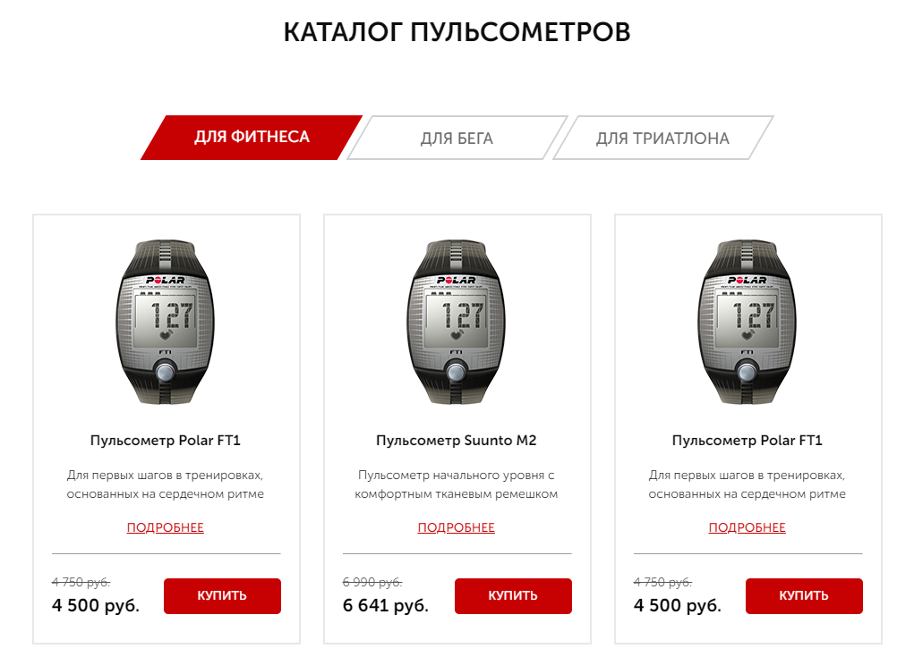

# Online Shop Landing Page

### This is one of my first projects I completed when started learning about HTML5 and CSS3. I created it with the help of the tutorial I found online. 

#### Technologies Used:

In the head section I used links to the libraries with sliders and ready-to-use animations to help me with the visual presentation.
For the body I stick to the semantic tags to create logical blocks of the website. All the scripts and libraries I placed in the end of the body so they don't disrubt the code loading.

 

As for the style, I divided the project into logical components based on the semantic tags. For the base I used mixins and variables for the main colors.

I used a little bit of JavaScript on the modal windows. In this project the main focus was on the structure and styles as I learned the basics of HTML/CSS. I used more advanced JS in my later projects - please check my [To-Do in vanilla JS](https://github.com/irinamiheeva13/ToDoVanilla) or [Calculator in vanilla JS](https://github.com/irinamiheeva13/CalculatorVanilla)

 

For the package management I used gulp. It watches all my files and compile them into the dist folder. 
As for the mail form I used a bit of php code that I learned through a tutorial. 

